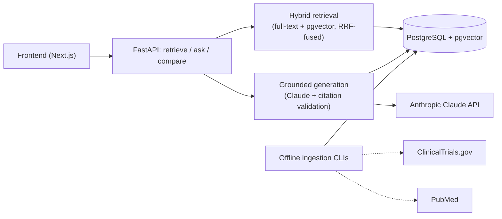

# TrialLens Lite

An evidence-grounded clinical-trial literature assistant that searches
ClinicalTrials.gov and PubMed-derived records, retrieves relevant trial and
publication evidence with hybrid search, and produces Claude-generated answers
with validated citations and supporting excerpts.

> Research use only. TrialLens Lite does not provide medical advice, diagnosis,
> treatment recommendations, or clinical decision support. See
> [`docs/known-limitations.md`](docs/known-limitations.md) for the full
> clinical-safety documentation.

## Live Demo

No live deployment exists. This is a portfolio project that has been built and
thoroughly unit/type/static-checked, but — per
[`docs/release-report.md`](docs/release-report.md) — has never actually been
run end-to-end (live backend process, live frontend build, live Docker Compose
stack) in any environment, so there is no URL to link here honestly. Run it
locally instead:

```bash
cp .env.example .env        # then set ANTHROPIC_API_KEY to use /ask or /compare
docker compose up --build
```

This starts `db` (Postgres 16 + pgvector), `backend` (FastAPI on
`http://localhost:8000`, OpenAPI UI at `/docs`), and `frontend` (Next.js on
`http://localhost:3000`). Full instructions, a local-dev-without-Docker path,
and a configuration reference: [`docs/deployment.md`](docs/deployment.md).

## Key Capabilities

- Clinical trial and publication search (keyword, full-text, and semantic)
- ClinicalTrials.gov and PubMed metadata ingestion, with upsert-safe
  deduplication by source ID and content hash
- Hybrid retrieval: PostgreSQL full-text search + pgvector semantic search
- Reciprocal Rank Fusion to combine the two retrieval signals
- Evidence-grounded Claude answers — every claim is generated only from
  retrieved text, never outside knowledge
- Citation validation against indexed source excerpts — an answer with a
  citation that doesn't resolve, or a claim with no citation at all, is never
  shown partially
- Trial comparison, with citations split by which trial they support
- An evaluation harness for Recall@5, MRR, citation correctness, citation
  completeness, and abstention accuracy (see Evaluation below for which of
  these have actually been measured so far)
- Docker-based local development and deployment

## Architecture



See [`docs/architecture.md`](docs/architecture.md) for the full diagram (all
four pipelines plus the evaluation harness) and a walk-through of exactly what
happens for one `/ask` request.

## Demo Questions

The questions below use trial/publication IDs from the project's own
synthetic demo corpus (fictional drugs "TL-101"/"TL-205" in a fictional
cancer, shaped like real ClinicalTrials.gov/PubMed API responses — built
synthetic because the environment this project was built in had no network
access to fetch real trial data). Load it first:

```bash
docker compose exec backend python -m app.evaluation.run_eval --claude-client real
```

Then try:

1. What is the primary endpoint of the TL-101 trial NCT90000001, and was it met?
2. Compare the eligibility criteria of NCT90000001 (adults) and NCT90000004
   (children) — both TL-101 in Stage III Fictional Carcinoma.
3. Which publications are linked to NCT90000001?
4. What evidence is available for TL-101 in Stage III Fictional Carcinoma?
5. What does the evidence say about using TL-101 to treat renal cell
   carcinoma? *(TL-101 is only studied for Fictional Carcinoma in this
   corpus — this should trigger an honest abstention, not a guess.)*

## Evaluation

A 20-question ground-truth set (15 answerable, 5 the system should abstain
on) against the 8-document synthetic demo corpus. Numbers below are exactly
what has been measured so far — nothing here is estimated or invented; see
[`docs/evaluation-report.md`](docs/evaluation-report.md) and
[`docs/release-report.md`](docs/release-report.md) for full methodology and
what still hasn't been measured.

| Metric | Value | Notes |
|---|---:|---|
| Recall@5 (hybrid-equivalent) | 0.9333 (14/15) | Real RRF fusion + real embeddings; cosine computed in Python because the build environment's Postgres had no `pgvector` extension installed — not yet re-measured through the actual pgvector SQL path |
| MRR (hybrid-equivalent) | 0.58 | same run, n=15 |
| Recall@5 (full-text only) | 0.00 | Real result — `plainto_tsquery`'s AND semantics fail against natural-language questions; this is why production always uses hybrid mode, never full-text alone |
| MRR (full-text only) | 0.00 | same run, n=15 |
| Citation correctness | not yet measured | needs a real Claude API call against this corpus — never run in any environment so far |
| Citation completeness | not yet measured | same |
| Abstention accuracy | not yet measured | same |

Run it yourself once you have a real `ANTHROPIC_API_KEY` and a Postgres with
`pgvector` installed:

```bash
python -m app.evaluation.run_eval --claude-client real
```

## Limitations

- The demo dataset is a small, fully **synthetic** corpus (8 documents,
  fictional drugs and trials) rather than a curated slice of the real
  ClinicalTrials.gov/PubMed corpora — built that way because the environment
  this project was authored in had no network access to fetch real trial
  data. See [`docs/known-limitations.md`](docs/known-limitations.md).
- Source linking may be incomplete where NCT identifiers are not present in a
  publication's own metadata (the demo corpus includes one such publication —
  a review article with no linked trial — deliberately, to reflect this).
- LLM-generated synthesis requires expert verification. Citation correctness,
  completeness, and abstention accuracy have not yet been measured against a
  real model (see Evaluation above); the fail-closed citation-validation code
  that would catch a fabricated or unsupported claim is real, tested code,
  but has only been exercised against scripted, not real, model responses.
- "No individualized medical advice" is a system-prompt instruction, not a
  mechanically-enforced check the way citation validity is — see
  [`docs/known-limitations.md`](docs/known-limitations.md) for exactly which
  safety commitments are code-enforced versus prompt-instructed.
- The application is not intended for diagnosis, treatment selection, or
  patient-specific guidance.
- This project has never been run end-to-end (live backend, live frontend
  build, live Docker Compose stack) in any environment — see
  [`docs/release-report.md`](docs/release-report.md), which does not certify
  it production-ready for exactly this reason.

## Tech stack

Python 3.12 / FastAPI / SQLAlchemy 2.x / Alembic, PostgreSQL 16 with
pgvector, Anthropic Claude SDK, Next.js / TypeScript / Tailwind CSS, Docker
Compose, Pytest / Vitest.

## More documentation

[`docs/README.md`](docs/README.md) indexes everything: per-phase build notes,
the full evaluation report, architecture diagram, known limitations, Docker
deployment/configuration reference, and the release-hardening audit
([`docs/release-report.md`](docs/release-report.md) — read this one before
deploying anything from this repository).
