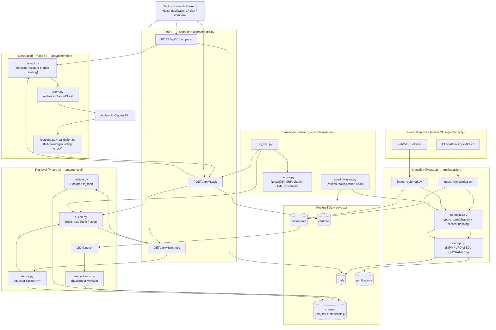

# Architecture

TrialLens Lite has four pipelines that share one PostgreSQL database, plus
a Phase 6 evaluation harness that exercises the real code in all of them:

1. **Ingestion** (Phase 2, offline CLI) pulls a curated set of trials and
   publications from ClinicalTrials.gov and PubMed, normalizes them into
   a common shape, deduplicates by source ID and content hash, and stores
   one `Document` per source.
2. **Retrieval** (Phase 3) chunks each `Document`, embeds the chunks,
   and answers a query via Postgres full-text search, pgvector cosine
   search, or both fused with Reciprocal Rank Fusion (RRF).
3. **Generation** (Phase 4) hands retrieved chunks to Claude, extracts
   and validates citations against the exact chunks retrieved, and fails
   closed (shows nothing, not a partial answer) if anything is
   unsupported.
4. **Frontend** (Phase 5) is a Next.js app that calls the three public
   endpoints — it never talks to the database directly and never
   fabricates a response.

Phase 6 adds an **evaluation harness** that reuses the real ingestion,
retrieval, and generation code against a synthetic ground-truth corpus,
plus the `Depends()`-based dependency-injection seam
(`backend/app/api/deps.py`) that lets an end-to-end test substitute a
scripted stand-in for the one dependency no sandbox can call for
real — the Anthropic API — without touching anything else.

*(This diagram's Mermaid source was rendered with `mmdc` — the
`@mermaid-js/mermaid-cli` package — in the sandbox that built this
phase, confirming it parses and lays out without error; see
`docs/phase-6-notes.md` for exactly how.)*

## Why the API layer takes its dependencies via `Depends()`

Phases 3–4 wrote `app/api/qa.py` and `app/api/retrieval.py` to call
`get_settings()` / `get_embedding_provider(settings)` /
`get_claude_client(settings)` as plain function calls inside each route
handler. That's fine for production, but it leaves no seam for
`app.dependency_overrides` — FastAPI's standard mechanism for
substituting a test double — to attach to. Phase 6 needed a real
end-to-end test that exercises the actual HTTP routing and retrieval SQL
without making a real Anthropic API call, so `app/api/deps.py` wraps
those three factories as ordinary `Depends()`-compatible callables. With
no override installed, they do exactly what the inline calls did before;
`tests/test_end_to_end.py` overrides only the Claude client (and `get_db`,
to share a transaction with the fixture-seeding code — see that test
file's docstring). No retrieval, generation, or citation-validation logic
changed.

## Data flow for one `/ask` request

1. `hybrid.search` runs full-text search (`ts_rank` /
   `plainto_tsquery`) and dense search (pgvector cosine distance) over
   `chunks`, each returning a ranked list of chunk IDs.
2. `fusion.reciprocal_rank_fusion` merges the two ranked lists by
   position (not raw score, since `ts_rank` and cosine similarity live on
   incomparable scales).
3. The top chunks are wrapped in numbered, injection-resistant
   `<retrieved_chunk index="N">` blocks (`prompt.py`) and sent to Claude
   with a system prompt that treats their content as untrusted data, not
   instructions.
4. Claude's response is checked for the exact abstention marker
   (`NOT_ENOUGH_EVIDENCE`) first, then every `[n]` citation marker in its
   text is resolved back against the *same* chunk list by position
   (`citations.py`) and every substantive sentence is checked for at
   least one citation (`validation.py`). Any invalid citation or any
   uncited substantive sentence fails the *whole* answer closed — no
   partial answer is ever shown.
5. Only a fully validated answer, with its resolved citations, is
   returned to the frontend.

## Why Recall@5/MRR need pgvector, but citation/abstention metrics need a real model

Recall@5 and MRR are properties of *retrieval* — they can be computed
from the ranked chunk-ID lists `hybrid.search`/`fulltext_search`/
`dense_search` return, with no model call at all. They need a real
Postgres with the `vector` extension for the dense/hybrid half (fulltext
alone doesn't need it, and Phase 6 exploited that to get one real
number in an environment without pgvector — see
`docs/evaluation-report.md`).

Citation correctness/completeness and abstention accuracy are properties
of a *generated answer* — they can only be computed from what Claude
actually wrote. There is deliberately no dependency-free "fake" grounded
answer generator in this project (see `app/generation/client.py`'s
docstring): a scripted stand-in can prove the harness's plumbing works,
but it cannot stand in for real model judgment, so those three metrics
require a real `ANTHROPIC_API_KEY` and network access to compute for
real, wherever that harness runs.
